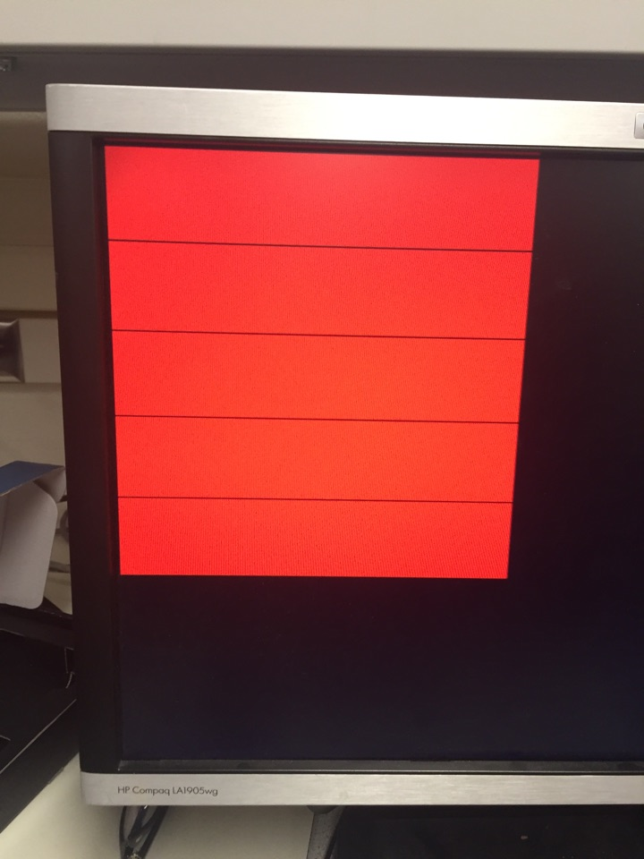
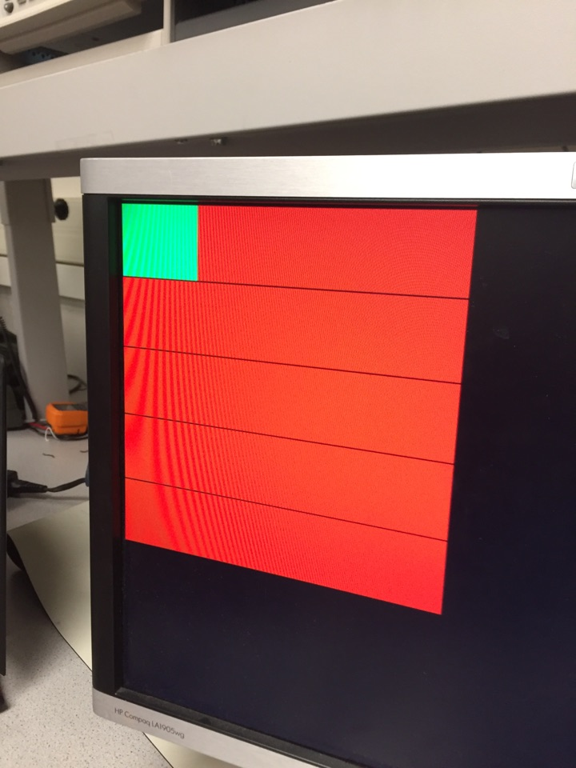

## Lab 4

### Objectives

For this lab, we had to implement radio communication between the Arduino and FPGA. 
### Radio Team
Russell, Giacomo

#### Materials
* 2 Nordic nRF24L01+ transceivers
* 2 Arduino Unos (one must be shared with the other sub-team)
* 2 USB A/B cables
* 2 radio breakout boards with headers


The example code provided an implementation of RF that would transmit the current time using the millis() function. The time value was sent on the transmitting end through the use of the radio.write() function. This value was received on the other Arduino through the use of the radio.read() function. 

We replaced the “got_time” variable that represented the time value in the example code with another unsigned long variable. This unsigned long variable would be used to send over coordinates in the later parts of this lab.

Instead of sending the entire maze wirelessly for each iteration at the end of the Arduino’s loop delay, we decided to only send the current coordinates’ x and y values. We represented the coordinate as a two digit number with the y value first and the x value second in the transmitting Arduino. For example, if we were to transmit the current coordinate (2,3), we would transmit 32. We thought that sending individual tile data would be better than sending the whole maze array as it reduces the number of packets between the transmitting and receiving arduinos for every “move” that our robot makes. 

On the receiving end, this two digit number would be converted back to an individual x and value through the use of the following lines:
   ```
   int x = recieved_x_variable % 10      //The remainder is the least significant digit 
   int y = recieved_y_variable / 10        //The divisor is the most significant digit
   ```
   
Once individual x and y values were extracted, we converted them into bit values which explained the in the maze communication section. The bit values would determine the digital outputs that would send the information parallely to the FPGA. For example, if x = 2 and y = 3, x would be set to 2’b10 and y would be set to 3’b011. Next, the digital pins corresponding to the most significant bit in the x value and 2 least significant bits in the y values would be set to HIGH, and the rest of the digital pins would be set to LOW.


### FPGA Team
Michelle, Kristina, Jo

#### Materials
* Arduino Board
* DE0-NANO Board 
* VGA Cable
* VGA Switch
* Various resistors

We updated our Verilog code from Lab 3 to display a 4 by 5 grid array instead of a 2 by 2 grid array. This was done by expanding upon the memory locations so that all of the grid’s 20 squares can be accounted for with their respective colors.

The code displayed below shows how we assigned pixel colors to all of gridscreen’s square areas.
 ```
    if (rdy == 0) begin
        gridscreen[0][0] = 8'b111_000_00;
        gridscreen[0][1] = 8'b111_000_00;
        gridscreen[0][2] = 8'b111_000_00;
        gridscreen[0][3] = 8'b111_000_00;
        gridscreen[0][4] = 8'b111_000_00;
     
        gridscreen[1][0] = 8'b111_000_00;
        gridscreen[1][1] = 8'b111_000_00;
        gridscreen[1][2] = 8'b111_000_00;
        gridscreen[1][3] = 8'b111_000_00;
        gridscreen[1][4] = 8'b111_000_00;
     
        gridscreen[2][0] = 8'b111_000_00;
        gridscreen[2][1] = 8'b111_000_00;
        gridscreen[2][2] = 8'b111_000_00;
        gridscreen[2][3] = 8'b111_000_00;
        gridscreen[2][4] = 8'b111_000_00; 
     
        gridscreen[3][0] = 8'b111_000_00;
        gridscreen[3][1] = 8'b111_000_00;
        gridscreen[3][2] = 8'b111_000_00;
        gridscreen[3][3] = 8'b111_000_00;
        gridscreen[3][4] = 8'b111_000_00;
        rdy = 1;
    end
```

The “rdy” bit was used to initialize the grid array. By initializing the grid array, we could avoid flickering blocks on the screen which signified that the Verilog Code was setting two colors at once on one grid square area. The rdy bit was initialized to 0 towards the top of our code so that the if statement would evaluate to true the first time. Once all the grid squares were set in “gridscreen” the rdy bit was set to 1 so that the grid array wouldn’t be initialized again.

We iterated through this memory area with double for loop taken from Lab 3’s implementation. Only the maximum values for variable “i” and “j” were changed in the double for loop as well as the “PIXEL_WIDTH” and “PIXEL_HEIGHT” for larger squares. This part of the implementation was scarcely changed because the iteration can set the square colors in a grid array of any arbitrary size.
The code for this iteration is shown below:
```
    PIXEL_WIDTH = 10'd64;
    PIXEL_HEIGHT = 10'd64;
      if ((PIXEL_COORD_X < 4 * PIXEL_WIDTH) && (PIXEL_COORD_Y < 5 * PIXEL_HEIGHT)) begin
   	    for (i = 10'd0; i <= 10'd4; i = i + 10'd1) begin
   		    for (j = 10'd0; j <= 10'd3; j = j + 10'd1) begin
   			    if(((j * PIXEL_WIDTH < PIXEL_COORD_X) && (PIXEL_COORD_X < (j + 10'd1) * PIXEL_WIDTH)) && ((i * PIXEL_HEIGHT < PIXEL_COORD_Y) && (PIXEL_COORD_Y < (i + 10'd1) * PIXEL_HEIGHT))) begin
   				    PIXEL_COLOR = gridscreen[j][i];
   			    end		 
   		    end	 
   	    end
      end
   	 
      else begin
   	    PIXEL_COLOR = 8'b000_000_00;
      end	
```



We next had to implement some communication system between the Arduino and the FPGA board. Our first attempt was for an SPI system: we coded the Arduino to send 5-bit dummy robot coordinates via digital pins (2 bits for the x coordinates, 3 bits for the y coordinate), and tested its functionality with the oscilloscope. A picture of its output is shown below for output (1, 1):


Our code for the FPGA is shown below: 
```
    always @ (posedge SPI_CLK) begin
    	    if(CS == 0 && rf == 0) begin
   	 
    	    for (i = 8'd0; i <= 8'd4; i = i + 8'd1) begin
        	    datain[i] = MOSI;
        	    rf = 1'b1;
    	    end
   	 
    	    //parsing
    	    //grid_coord_x = datain[4:3];
    	    //grid_coord_y = datain[2:0];
   	      //grid_coord_x = 4'd2;
   	      // grid_coord_y = 5'd3;
   	      rf = 1'b0;
 	        end
      end
```      
We abandoned our attempt at SPI after we ran into problems debugging. Instead, we implemented parallel communication between the Arduino and the FPGA board due to time constraints and our unfamiliarity with SPI protocol. Additionally, the Arduino pins required for the RF module utilized the same pins as that of the SPI, so instead of using a multiplexer or some other form of hardware solution for this, we decided to implement the parallel communication. 

```
always @ (posedge CLOCK_50) begin
   	x1 = GPIO_0_D[25];
   	x2 = GPIO_0_D[24];
   	y1 = GPIO_0_D[27];
   	y2 = GPIO_0_D[26];
   	y3 = GPIO_0_D[31];
end
```

After ensuring that the Arduino was outputting correctly, we then built a series of voltage dividers (100 and 50 ohms) to pass the data from the Arduino to the FPGA, due to the voltage mismatches between the two boards, and connected the Arduino outputs to the appropriate GPIO pins. Our setup is shown below:

.

The robot was simulated to move across the screen back and forth in the x directions. Once a side was reached, the simulated robot would move one space down the screen. Once the final grid space has been reached (bottom right corner of the grid), the simulated robot would reset itself at (0,0)

Here is a video of the serial monitor displaying the new coordinates of the simulated robot that are sent to the fpga to be displayed on the screen:

https://www.youtube.com/watch?v=iMkuTcneBeA 

Based on the new x coordinate and y coordinate of the simulated robot, the memory array for the grid was updated to store the color green into the current grid square. Once a grid square was colored green, it would be set to blue to indicate that the area has already been explored. If the robot was to reach an explored area again, the area would turn green indicating the robot’s position regardless of whether the grid square was explored or not. 
The following picture displays the grid for the initial position of the simulated robot which is (0,0). The green square displays the starting area of the robot and the red squares display unexplored areas for the simulated robot.



While we did not have the chance to test this section of the code due to the previous issues, we wrote out the following code to so that the previously visited locations would turn blue. To implement this we would save the location to two registers, then this register would be used in the next cycle after the new current location had been updated to change the location to blue. The following is the write out of the code.

```
   gridscreen[lastsquare_x][lastsquare_y] = 8'b000_000_11;
   lastsquare_x = grid_coord_x;
   lastsquare_y = grid_coord_y;
```

The actual grid is not updating correctly. The radio is set up to snake through the grid: it would start at (0,0), move right 3 coordinates, move down 1 coordinate, move left 3 coordinates, etc, of which the grid is not updating correctly. A video of our current result is shown below; we have not yet finished debugging the code:

[Attempt 1](https://youtu.be/67F9fmcdOR8)

[Attempt 2](https://youtu.be/riq3GrkjOTQ)

[Attempt 3](https://youtu.be/VIkMuR-udGA)

We ran into many bugs when attempting to implement the grid. The initial problem we faced was flickering squares between red and green when trying to display the grid. We fixed this issue by implementing the previously described ready bit so that the initial grid would be displayed every cycle. After this point the grid was displaying properly however there were inconsistent values of “visited” blocks that would show up on the grid. One potential cause we found was that the values on the arduino and FPGA code were left floating so they could have been incrementing intermittently. We fixed this issue by initializing the values both on the arduino and FPGA side. After this there was some consistency in the incorrect values, the first and third rows consistently remained red. Because these rows were the odd rows we determined that the least significant bit was not displaying correctly. To check the overall FPGA logic to ensure that it was properly evaluating this value, we hard coded the value of 1 to the least significant bit. The results of this test was that both of the odd rows started changing to the green color when anticipated. This confirmed that our FPGA logic was correct. To further debug this issue, we tried switching the pins on both the arduino and the FPGA. We then tried probing the line with the oscilloscope and received the correct high voltage signal. This confirmed that FPGA was receiving the signal. Then we tried outputting this value to an LED on the FPGA. The LED however would not light up to the corresponding signal. Another hypothesis that we had about the potential issue is that the sampling rate on the FPGA was too high. We tried switching the 25 clock however this did not fix the issue. Additionally, we changed the delay between the sending of each packet from the arduino to the FPGA in case the FPGA needed more time to read the data. However, this also did not fix our issue.

Here is the FPGA initialization code:
```
 initial begin
    	rdy = 0;
   	  x1  = 0;
   	  x2  = 0;
   	  y1  = 0;
   	  y2  = 0;
   	  y3  = 0;
      end  
```
