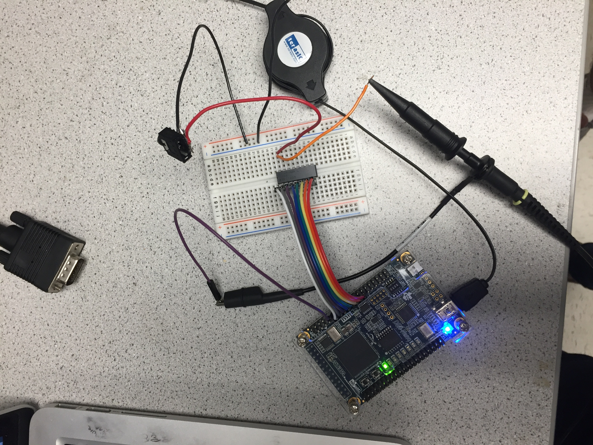
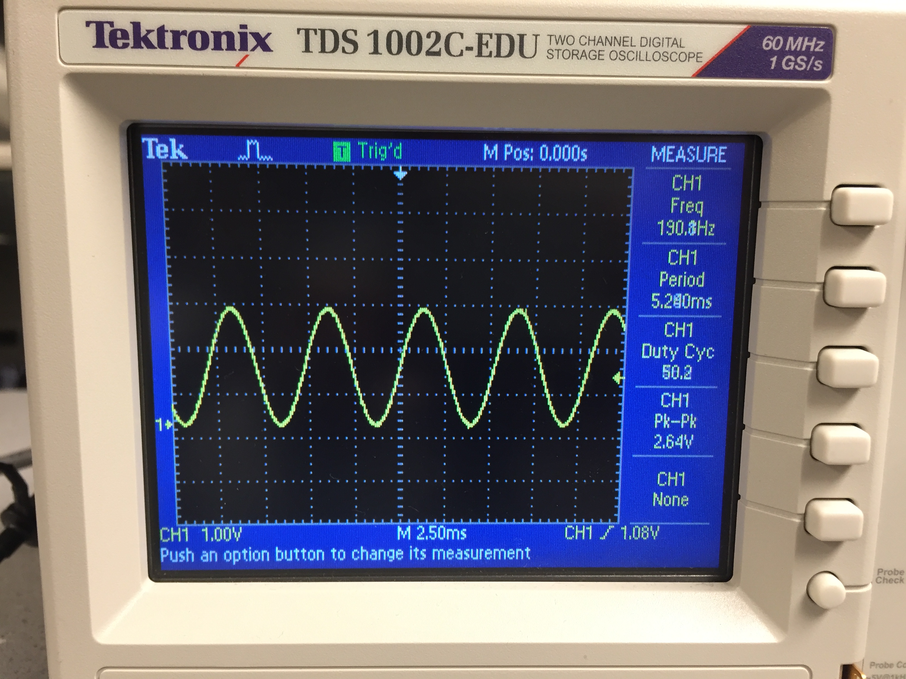

## Lab 3

### Objective

### Acoustic Team 
(Giacomo, Kristina)

### Materials:
* Lab Speaker
* 8-bit R2R DAC
* 3.5 mm auxiliary jack  

### Square Wave
The initial part of the lab that we implemented was using the FPGA to generate a square wave. We selected a frequency of 440Hz for the square wave and connected this output to GPIO pin 0 because it was not previously in use. The following code was used to implement the square wave along with the addition of the counter and CLKDIVIDER_440 to the initial section of the code with parameter declarations. For the wiring, we used a breadboard and connected the GPIO pin to the two data pins on the phone jack socket. Additionally, we soldered the two side pins together to increase ease of use. The sound generated and the setup is shown in the [here](https://www.youtube.com/watch?v=MgeT1byl4v8&feature=youtu.be). The square wave generated is shown in the picture below.

```
always @ (posedge CLOCK_25) begin
		if(counter == 0) begin
		counter <= CLKDIVIDER_440 - 1;
		square_440 <= ~square_440;
		end
		else begin
			counter <= counter - 1;
			square_440 <= square_440;
			  end
	 End
```


### Sin Wave
The next phase we decided to implement was a single sine wave to generate a better clearer sounding tone. To implement this we needed to use an 8-bit R2R DAC because the output from the FPGA to the speaker is not longer one of two values as with the square wave. We wire the inputs from GPIO pins to pins 1-8 of the DAC and then connected pin 16 of the DAC to the speaker input. This wiring setup is depicted in the following picture.


Then we wrote the following code to implement the sin wave.
```
reg [7:0] sine[0:255];
reg [10:0] counter1;
   
initial
     	Begin
sine[0] <= 8'd100;
sine[1] <= 8'd102;
	//remaining sin table values
	sine[255] <= 8'd98;

     end

     assign GPIO_1_D[8] = q[7];
     assign GPIO_1_D[10] = q[6];
     assign GPIO_1_D[12] = q[5];
     assign GPIO_1_D[14] = q[4];
     assign GPIO_1_D[16] = q[3];
     assign GPIO_1_D[18] = q[2];
     assign GPIO_1_D[20] = q[1];
     assign GPIO_1_D[22] = q[0];

always @ (posedge CLOCK_25) begin
             if (counter1 == 127 ) begin
                    counter1 <= 0;
                    q  <=  sine[ADDR];
                    if (ADDR == 255)
                            ADDR <= 0;
                    else
                            ADDR <= ADDR + 1;
             end
             else
                    counter1 <= counter1 + 1;    
end
```
The code was set up so that a counter would control the selection of the values in a sin table the output that corresponding value to create a sin graph. We used a counter that  would increment continuously with the clock frequency of 25MHz, and once the counter reached the value of 127 it would restart. This counter was used to determine when to increment the ADDR, specifically when the counter would reach the value of 127. We selected this value as when it included 0 there are 128 total values in order to produce a audible sine wave through the speakers. The incrementation of the counter was implemented with an if statement, and the incrementation of ADDR used an embedded if statement.  To implement the sin table for use we used direct digital synthesis. We decided to create a sin table outside of verilog for convenience. We implemented this in Matlab using the following code then copied and pasted into our project. We chose to create a sin table of one period with 256 plotted values because the number corresponds easily to the values of the 8-bit DAC. To ensure that our table was correct we graphed the values. The 8 separate GPIO pins were set to output corresponding to each input on the DAC. The GPIO pins were selected because they were previously not in use. See the video of the sin wave producing a sound[here](https://www.youtube.com/watch?v=-vzeRQowzgA).

```
total = 255;
for t = 0:total 
 	   value = round(100*sin((6.283*t)/total)+100);
  	  values(t) = value;
  	  fprintf('sine[%d] <= 8''d%d;\n',t, value)
end
```


### Tri Tone
To implement the tri tone, we decided to use three tones given by sin waves with different frequencies to create this. To implement this we used a setup similar to the code for the sin wave and repeated a similar version of the sin code three times. To cycle through these tones we implemented a finite state machine. The transition between each of the states, we wait until one second passes dependent on the clock cycle to move onto the next state. The wiring setup between the FPGA, to the DAC, to the speaker is the same as the setup for the individual sin wave. Our finite state machine is shown below:

```
always @ (posedge CLOCK_25) begin
     next_state = 2'b00;
     case(state)
   	 TONE1: if (tone_length == ONE_SEC) begin
   				 next_state = TONE2;
   				 tone_length = 0;
   		 	end
   			  else begin
   				 next_state = TONE1;
   				 tone_length = tone_length + 1;
   			  end
   	 TONE2: if (tone_length == ONE_SEC) begin
   				 next_state = TONE3;
   				 tone_length = 0;
   			  end
   			  else begin
   				 next_state = TONE2;
   				 tone_length = tone_length + 1;
   			  end
   	 TONE3: if (tone_length == ONE_SEC) begin
   				 next_state = TONE1;
   				 tone_length = 0;
   			  end
   			  else begin
   				 next_state = TONE3;
   				 tone_length = tone_length + 1;
   			  end
   	 default: next_state = TONE1;
     endcase
end

always @ (posedge CLOCK_25) begin
    state <= next_state;
end

always @ (posedge CLOCK_25) begin
    
     ///// TONE 1 //////
     if (state == TONE1) begin
   	  if (counter1 == 127 ) begin
   		 counter1 <= 0;
   		 q  <=  sine[ADDR];
   		 if (ADDR == 255)
   			 ADDR <= 0;
   		 else
   			 ADDR <= ADDR + 1;
   	  end
   	  else
   		 counter1 <= counter1 + 1;
      end
      
      ///// TONE 2 ////
      if (state == TONE2) begin
   	  if (counter1 == 255 ) begin
   		 counter1 <= 0;
   		 q  <=  sine[ADDR];
   		 if (ADDR == 255)
   			 ADDR <= 0;
   		 else
   			 ADDR <= ADDR + 1;
   	  end
   	  else
   		 counter1 <= counter1 + 1;
      end         
      
      ///// TONE 3 /////
      if (state == TONE3) begin
   	  if (counter1 == 511 ) begin
   		 counter1 <= 0;
   		 q  <=  sine[ADDR];
   		 if (ADDR == 255)
   			 ADDR <= 0;
   		 else
   			 ADDR <= ADDR + 1;
   	  end
   	  else
   		 counter1 <= counter1 + 1;
      end    
      
end
```
The video of the implemented tri tone waves can be seen [here](https://www.youtube.com/watch?v=4RYInz8DY74). The video of the tri tone sound can be seen [here](https://www.youtube.com/watch?v=qpzVlRkj_Dc).


### Objectives
Graphics: Take external inputs to the FPGA and display them on a screen. This is the beginning of our “maze” 
Acoustics: Take a external input to the FPGA and generate a short ‘tune’ consisting of at least three tones to a speaker via an 8-bit DAC.

### Graphics
(Russell, Michelle, Joan)

### Materials 
1 VGA screen
1 VGA cable
1 VGA connector
1 VGA switch
Various resistors

Our team decided to sequentially divide our work into four portions. The first task was to display the logic levels of two input switches on the FPGA board to four LEDs on the FPGA board. Second, the logic levels of two input switches on the FPGA board would be displayed to the computer screen. Third, the code would be modified to save memory space and be able to display a “map” later on in the semester.  Last, outputs from the Arduino Uno would be displayed onto the computer screen.

A.Switches to LED lights on the FPGA board

We implemented a finite state machine that would check if the current “gridarray” coordinate matched that of the inputs and would save a 1 to that register accordingly.  Next, the machine go to state_0 and increment the “gridarray” coordinates.  is our code working.

Here is the code for this part:
```
if (state==1'b1) begin //switch input
	//led_counter <= 25'b0;
	if( grid_coord_y == highlighted_y && grid_coord_x == highlighted_x) begin
		gridarray[grid_coord_x][grid_coord_y] <= 1'b1;
	end
				
	else begin
		gridarray[grid_coord_x][grid_coord_y] <= 1'b0;
end
				
	state <= 1'b0;		
end
		  
if(state==1'b0) begin //increment grid index
	if (grid_coord_x == 1'b0 && grid_coord_y == 1'b0) begin
		grid_coord_x <= 2'b00;
		grid_coord_y <= 2'b01;
	end
			
	else if (grid_coord_x == 1'b0 && grid_coord_y == 1'b1) begin
		grid_coord_x <= 1'b1;
		grid_coord_y <= 1'b0;
	end
				
	else if (grid_coord_x == 1'b1 && grid_coord_y == 1'b0) begin
		grid_coord_x <= 1'b1;
		grid_coord_y <= 1'b1;
	end
				
	else begin
		grid_coord_x <= 1'b0;
		grid_coord_y <= 1'b0;
	end

	// led_state   <= led_state;
	//led_counter <= led_counter + 25'b1;
	state <= 1'b1;		  
end
```
B.Switches on FPGA board to computer screen grid
      
In the second part, instead of outputting to LED lights, we outputted to four pins on the FPGA board (GPIO_0_D ). These GPIO pins were used in controlling the colored square on the screen. Here is a video demonstrating the changing position of the square based on switch logic levels:

https://www.youtube.com/watch?v=1_f9FdkPpto 

In this part of the lab we used an 8-bit DAC which converted the signals from the FPGA board to analog signals between 0 and 1 V.  The digital pixel information to be transmitted from the FPGA consisted of 3-bits specifying the red color, 3-bits specifying the green color and 2-bits to specifying the blue color. When all 8 bits are 1’s, the DAC will essentially read these digital signals as three 1 V signals ( and the VGA screen will display white). For the 3-bit colors, the first bit is the more “significant” because it represents a number of higher order ( 22) whereas the last bit represents a number of lower order ( 20). To account for this, we want to choose resistor values which would add more “weight” to the first bit. Essentially, when the most significant bit is 1, we want the output to be 4/7 V.  Internal resistance of the VGA display is 50 ohms. The FPGA outputs 3.3V. 

Calculate resistance R for most significant bit of 3 bits:

4/7 V= 3.3V * 50/(50+R)  ⇒        R= 238.75 Ohms

Similarly, the resistance needed for the second most significant bit is 527.5 Ω and the resistance needed for the least significant bit is 1105 Ω. 

For the 2-bit color ( blue), the resistance for the most significant bit is 197.5 Ω and the resistance for the least significant bit is 445 Ω. 

It should be noted that resistors were already chosen and soldered into the DAC we used to complete this lab. 

C.Saving Memory 

In order to make our program more efficient and adaptable for future uses (e.g. more grid spaces with images), we decided to implement a double “for” loop that sequenced over a two dimensional memory array. The two dimensional array was initialized as a register named “gridscreen” storing eight bit values as shown in our merged code. Each element in “gridscreen” contained 8 bits in order to properly store the 8 bit data representations of the pixel colors. 
always @ (posedge CLOCK_50) begin
   ``` 
   if(gridarray[0][0] == 1'b1) begin
   	gridscreen[0][0] = 8'b000_111_00; //green
   	gridscreen[0][1] = 8'b000_000_11; //blue
   	gridscreen[1][0] = 8'b111_000_00; //red
   	gridscreen[1][1] = 8'b111_000_11; //purple
   end
   	 
   else if (gridarray[0][1] == 1'b1) begin
   	gridscreen[0][0] = 8'b111_000_11; //purple
   	gridscreen[0][1] = 8'b000_111_00; //green
   	gridscreen[1][0] = 8'b000_000_11; //blue
   	gridscreen[1][1] = 8'b111_000_00; //red
   end
   	 
   else if (gridarray[1][0] == 1'b1) begin
   	gridscreen[0][0] = 8'b111_000_00; //red
   	gridscreen[0][1] = 8'b111_000_11; //purple
   	gridscreen[1][0] = 8'b000_111_00; //green
   	gridscreen[1][1] = 8'b000_000_11; //blue
   end
   	 
   else begin
   	gridscreen[0][0] = 8'b000_000_11; //blue
   	gridscreen[0][1] = 8'b111_000_00; //red
   	gridscreen[1][0] = 8'b111_000_11; //purple
   	gridscreen[1][1] = 8'b000_111_00; //green
   end
   	 
   PIXEL_WIDTH = 10'd16;
   PIXEL_HEIGHT = 10'd16;
   if ((PIXEL_COORD_X < 2 * PIXEL_WIDTH) && (PIXEL_COORD_Y < 2 * PIXEL_HEIGHT)) begin
   	for (i = 10'd0; i <= 10'd1; i = i + 10'd1) begin
   		for (j = 10'd0; j <= 10'd1; j = j + 10'd1) begin
   			if(((j * PIXEL_WIDTH < PIXEL_COORD_X) && (PIXEL_COORD_X < (j + 10'd1) * PIXEL_WIDTH)) && ((i * PIXEL_HEIGHT < PIXEL_COORD_Y) && (PIXEL_COORD_Y < (i + 10'd1) * PIXEL_HEIGHT))) begin
   				PIXEL_COLOR = gridscreen[j][i];
   			end		 
   		end	 
   	end
   end
   	 
   else begin
   	PIXEL_COLOR = 8'b000_000_00;
   end	 
end
```
The four beginning control blocks decide which colors will be stored in each individual grid space. Since the current objective was a 2x2 grid, four different colors were stored in a top left, top right, bottom left, and bottom right grid space. The widths and heights of these grid spaces were defined right before the double for loop.

In order to understand the functionality of the double for loop method that was implemented, several points must be made:

Each index “i” or “j” corresponds to a grid space in the same fashion as the indexes in “gridscreen.” In this way, the register PIXEL_COLOR can be assigned to the color information stored inside “gridscreen” at those indexes. 
The current index “i” or “j” is multiplied by the height and width of each grid space respectively in the if statement. This is to define the bounds of the space that is being colored in at the current iteration of the for loop.
Since the “j” for loop is inside the “i” for loop, the grid spaces are colored in across the screen until the last grid space is reached in the x direction. Then the process repeats, but at a “PIXEL_HEIGHT” lower than the previous row. 
The qualifying if-else statement that is a scope above the double for loop defines all the pixels in the screen that aren’t being used, and colors them in a default color (“PIXEL_COLOR = 8’b000_000_00 //black”).

A more common approach to this problem consisted of using case statements to define the widths and heights for each grid space, and then assigning each element of the memory array to each grid space. The double for loop method was picked over this implementation for the purposes of more code efficiency and adaptability. The double for loop method was more efficient because only several lines of code were written, when dozens of case statements would have been needed for the case statement method.

Moreover, if a 10x10 grid was drawn, only the code in the control blocks from the beginning of the code would need to be expanded upon. It would not be necessary to add lines of code to the bodies of the for loops. We would only need to change the variables “i”, “j”, “PIXEL_WIDTH”, and “PIXEL_HEIGHT” in most cases.

The adaptability of this code will be helpful when displaying a maze for the final competition. The memory arrays can be easily updated to display image files instead of colors and several control statements can be added inside the body of the double for loop in order to identify and display which grid space the robot is located in real time. 

The efficiency of the code will mitigate potential screen latency in the final competition when displaying the robot’s location on the screen. This is because our simplified iterative system consists of a lower amount of data storages and calculations, conserving memory and computational power.
